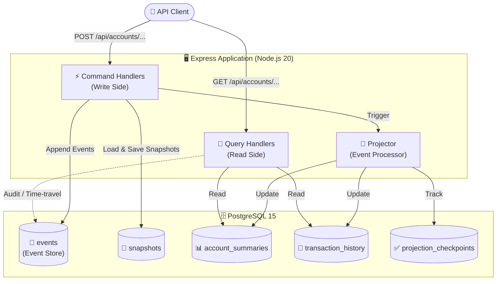
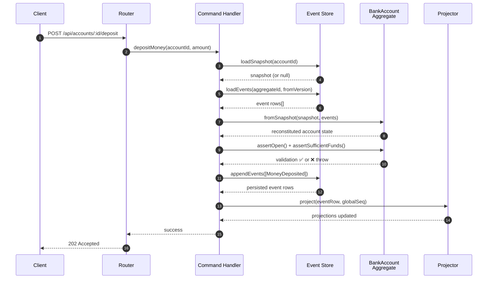
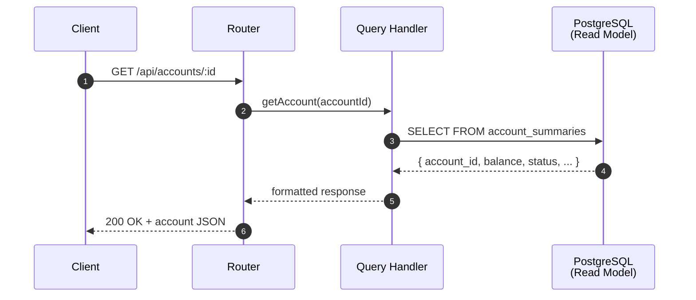
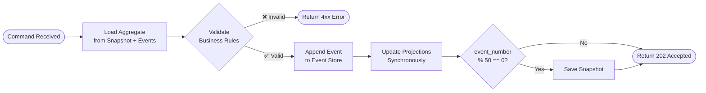
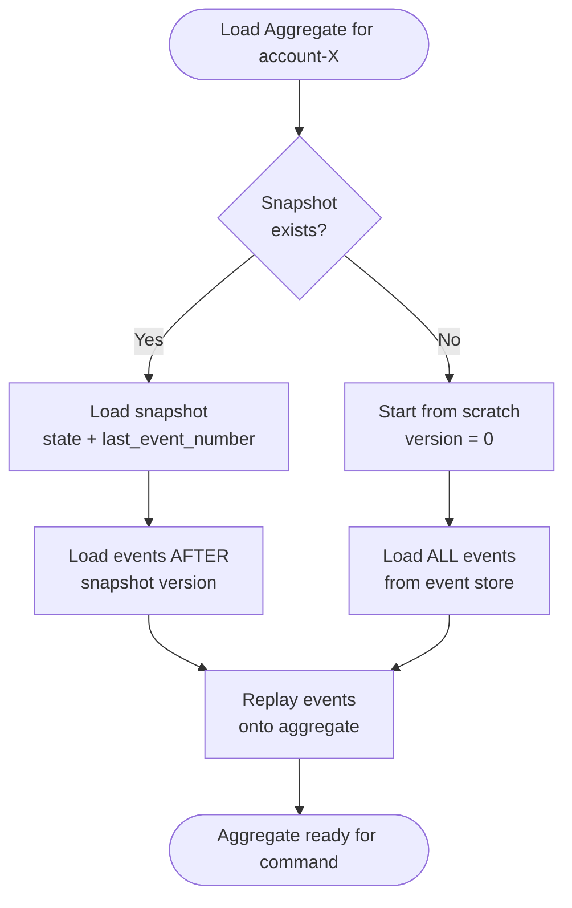
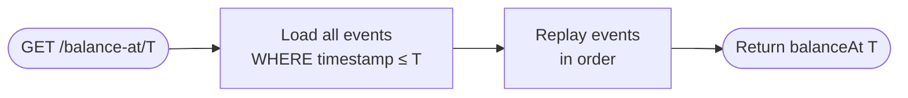

<div align="center">


### *Event Sourcing + CQRS — Production-Grade Financial Backend*

[](https://nodejs.org)
[](https://www.postgresql.org)
[](https://www.docker.com)
[](https://expressjs.com)
[](LICENSE)

> A fully containerized, production-ready bank account management API built on **Event Sourcing** and **CQRS** architectural patterns — complete with audit trails, time-travel queries, snapshotting, idempotency, and real-time projection tracking.

---

[🚀 Quick Start](#-quick-start) • [📐 Architecture](#-architecture) • [📡 API Reference](#-api-reference) • [🧪 Testing](#-testing) • [📁 Project Structure](#-project-structure)

</div>

---

## 🌟 Core Features

| Feature | Description |
|---|---|
| 🔄 **Event Sourcing** | All state changes stored as immutable events — full audit trail forever |
| ✂️ **CQRS** | Separate write (commands) and read (queries) models |
| ⏱️ **Time-Travel Queries** | Reconstruct account state at any historical timestamp |
| 📸 **Snapshotting** | Automatic snapshots every 50 events to optimize load time |
| 🔁 **Idempotency** | Duplicate commands with same `transactionId` safely ignored |
| 🔒 **Optimistic Concurrency** | Unique constraint prevents concurrent write corruption |
| 🏥 **Health Checks** | Docker-native health checks on both app and database |
| 🔧 **Projection Rebuild** | Full read-model reconstruction from event history |

---

## 🚀 Quick Start

### Prerequisites

| Tool | Version |
|---|---|
| Docker | 20.x+ |
| Docker Compose | 2.x+ |

### 1 · Clone and Configure

```bash
# Clone the repository
git clone <repository-url>
cd week-13-mandatory

# Copy environment variables
cp .env.example .env
```

### 2 · Launch Everything

```bash
docker-compose up --build
```

> ⏳ First start downloads images and seeds the database automatically. Allow ~60 seconds.

### 3 · Verify

```bash
curl http://localhost:8080/health
# → {"status":"ok","timestamp":"2026-02-25T05:20:07.000Z"}
```

---

## 📐 Architecture

### System Overview



---

### CQRS Flow: Command Side



---

### CQRS Flow: Query Side



---

### Event Lifecycle



---

### Snapshotting Strategy



---

### Time-Travel Query



---

## 📡 API Reference

### 🔴 Command Endpoints *(Write Side)*

| Method | Endpoint | Body | Success | Notes |
|---|---|---|---|---|
| `POST` | `/api/accounts` | `{ accountId, ownerName, initialBalance, currency }` | `202` | Generates `AccountCreated` |
| `POST` | `/api/accounts/:id/deposit` | `{ amount, description, transactionId }` | `202` | Generates `MoneyDeposited` |
| `POST` | `/api/accounts/:id/withdraw` | `{ amount, description, transactionId }` | `202` | Generates `MoneyWithdrawn` |
| `POST` | `/api/accounts/:id/close` | `{ reason }` | `202` | Balance must be zero |

### 🟢 Query Endpoints *(Read Side)*

| Method | Endpoint | Query Params | Notes |
|---|---|---|---|
| `GET` | `/api/accounts/:id` | — | Returns from projection |
| `GET` | `/api/accounts/:id/events` | — | Full event stream (audit) |
| `GET` | `/api/accounts/:id/balance-at/:timestamp` | — | Time-travel (ISO 8601) |
| `GET` | `/api/accounts/:id/transactions` | `page`, `pageSize` | Paginated history |

### ⚙️ Admin Endpoints

| Method | Endpoint | Notes |
|---|---|---|
| `POST` | `/api/projections/rebuild` | Truncate & replay all events |
| `GET` | `/api/projections/status` | Shows lag per projection |
| `GET` | `/health` | Docker health check |

---

### HTTP Status Code Guide

```
200 OK           → Successful read
202 Accepted     → Command accepted and processed
400 Bad Request  → Invalid input / missing fields
404 Not Found    → Account does not exist
409 Conflict     → Business rule violation
                   (ACCOUNT_EXISTS | INSUFFICIENT_FUNDS | ACCOUNT_CLOSED | NON_ZERO_BALANCE)
```

---

## 💡 Usage Examples

### Create → Deposit → Withdraw → Query

```bash
BASE=http://localhost:8080/api

# 1. Create account
curl -s -X POST $BASE/accounts \
  -H "Content-Type: application/json" \
  -d '{"accountId":"acc-001","ownerName":"Alice Smith","initialBalance":0,"currency":"USD"}'
# → 202 {"message":"Account creation accepted","accountId":"acc-001"}

# 2. Deposit $500
curl -s -X POST $BASE/accounts/acc-001/deposit \
  -H "Content-Type: application/json" \
  -d '{"amount":500,"description":"Initial deposit","transactionId":"txn-001"}'
# → 202

# 3. Withdraw $200
curl -s -X POST $BASE/accounts/acc-001/withdraw \
  -H "Content-Type: application/json" \
  -d '{"amount":200,"description":"Rent","transactionId":"txn-002"}'
# → 202

# 4. Check balance (should be 300)
curl -s $BASE/accounts/acc-001
# → {"accountId":"acc-001","ownerName":"Alice Smith","balance":300,"currency":"USD","status":"OPEN"}

# 5. View full event history
curl -s $BASE/accounts/acc-001/events
# → [{eventType:"AccountCreated",...},{eventType:"MoneyDeposited",...},{eventType:"MoneyWithdrawn",...}]

# 6. Time-travel: balance before the withdrawal
curl -s "$BASE/accounts/acc-001/balance-at/2026-01-01T00:00:00Z"
# → {"accountId":"acc-001","balanceAt":500,"timestamp":"..."}

# 7. Paginated transactions
curl -s "$BASE/accounts/acc-001/transactions?page=1&pageSize=10"
```

### Projection Rebuild

```bash
# 1. View current status
curl -s $BASE/projections/status

# 2. Trigger rebuild (async, returns 202 immediately)
curl -s -X POST $BASE/projections/rebuild

# 3. Status shows lag=0 once complete
curl -s $BASE/projections/status
```

---

## 📁 Project Structure

```
week-13-mandatory/
│
├── 🐳 docker-compose.yml         # Service orchestration
├── 🐳 Dockerfile                 # Node.js 20 Alpine image
├── 📋 .env.example               # Environment variable template
├── 📋 .env                       # Active environment config
├── 📄 submission.json            # Test harness account data
├── 📖 README.md                  # This file
├── 📐 architecture.md            # Deep architectural documentation
├── 📘 projectdocumentation.md    # Full project documentation
│
├── 🌱 seeds/
│   └── 01_schema.sql             # All table schemas (auto-loaded by PostgreSQL)
│
└── 🧠 src/
    ├── index.js                  # Entry point — DB retry + server start
    ├── app.js                    # Express setup, routes, error handler
    ├── db.js                     # PostgreSQL connection pool
    ├── eventStore.js             # Core event store (append, load, snapshot)
    │
    ├── domain/
    │   └── BankAccount.js        # Aggregate: event replay + business rules
    │
    ├── commands/
    │   └── index.js              # Write-side handlers (4 commands)
    │
    ├── queries/
    │   └── index.js              # Read-side handlers (4 queries)
    │
    ├── projectors/
    │   └── index.js              # Projection updater, rebuild, status
    │
    └── routes/
        ├── accounts.js           # /api/accounts route definitions
        └── projections.js        # /api/projections route definitions
```

---

## 🗄️ Database Schema Overview

```
┌──────────────────────────────────────────────────┐
│                  WRITE MODEL                      │
│                                                   │
│  events                          snapshots        │
│  ┌────────────────────┐          ┌─────────────┐  │
│  │ event_id (PK)      │          │ snapshot_id │  │
│  │ aggregate_id  ──── ├──────────┤ aggregate_id│  │
│  │ aggregate_type     │          │ snapshot_data│ │
│  │ event_type         │          │ last_event_#│  │
│  │ event_data (JSONB) │          │ created_at  │  │
│  │ event_number       │          └─────────────┘  │
│  │ timestamp          │                            │
│  │ version            │                            │
│  └────────────────────┘                            │
└──────────────────────────────────────────────────┘

┌──────────────────────────────────────────────────┐
│                  READ MODEL                       │
│                                                   │
│  account_summaries       transaction_history      │
│  ┌─────────────────┐     ┌──────────────────┐    │
│  │ account_id (PK) │     │ transaction_id   │    │
│  │ owner_name      │     │ account_id       │    │
│  │ balance         │     │ type (DEP/WITH)  │    │
│  │ currency        │     │ amount           │    │
│  │ status          │     │ description      │    │
│  │ version         │     │ timestamp        │    │
│  └─────────────────┘     └──────────────────┘    │
│                                                   │
│  projection_checkpoints                           │
│  ┌────────────────────────────────────────┐       │
│  │ projection_name | last_processed_event │       │
│  │ AccountSummaries | 150                 │       │
│  │ TransactionHistory | 150               │       │
│  └────────────────────────────────────────┘       │
└──────────────────────────────────────────────────┘
```

---

## 🌍 Environment Variables

| Variable | Description | Example |
|---|---|---|
| `API_PORT` | Port for the application server | `8080` |
| `DATABASE_URL` | Full PostgreSQL connection string | `postgresql://user:password@db:5432/bank_db` |
| `DB_USER` | PostgreSQL username | `user` |
| `DB_PASSWORD` | PostgreSQL password | `password` |
| `DB_NAME` | PostgreSQL database name | `bank_db` |

---

## 🧪 Testing

Run the included automated test script:

```bash
# Ensure containers are running, then:
powershell -ExecutionPolicy Bypass -File test_all.ps1
```

Expected output: **25 PASSED, 0 FAILED**

Tests cover:
- Account creation, duplicate rejection
- Deposit, withdrawal, over-withdrawal
- Account close with/without balance
- Read-model accuracy after operations
- Event stream ordering
- Time-travel balance reconstruction
- Paginated transaction history
- Projection rebuild and restoration
- Projection status and lag tracking
- Snapshotting after 50 events

---

## 🔐 Business Rules

```
✅ Accounts must have a unique accountId
✅ Deposits must be positive amounts
✅ Withdrawals cannot exceed current balance
✅ Accounts cannot be closed unless balance = 0
✅ Deposits/withdrawals to CLOSED accounts are rejected
✅ Duplicate transactionIds are silently ignored (idempotency)
✅ Concurrent writes detected via UNIQUE(aggregate_id, event_number)
```

---

## 🏗️ Tech Stack

| Layer | Technology | Reason |
|---|---|---|
| Runtime | **Node.js 20 Alpine** | Lightweight, async-first, large ecosystem |
| Framework | **Express.js 4** | Minimal, battle-tested HTTP layer |
| Database | **PostgreSQL 15** | JSONB support, ACID transactions, native constraints |
| ORM/Driver | **node-postgres (pg)** | Direct SQL for full control |
| Containerization | **Docker + Compose** | Reproducible environments, health checks |
| ID Generation | **uuid v4** | Collision-resistant unique event IDs |

---

<div align="center">

**Built with ❤️ for the Week 13 Mandatory Assessment**

*Event Sourcing · CQRS · PostgreSQL · Docker · Node.js*

</div>
