# 🏛️ System Architecture

> **Bank Account Management System — Event Sourcing & CQRS**  
> Deep architectural reference for engineers and reviewers.

---

## Table of Contents

1. [Architectural Overview](#1-architectural-overview)
2. [Pattern: Event Sourcing](#2-pattern-event-sourcing)
3. [Pattern: CQRS](#3-pattern-cqrs)
4. [System Component Diagram](#4-system-component-diagram)
5. [Database Architecture](#5-database-architecture)
6. [Write Model: Command Pipeline](#6-write-model-command-pipeline)
7. [Read Model: Query Pipeline](#7-read-model-query-pipeline)
8. [Projection Engine](#8-projection-engine)
9. [Snapshotting Strategy](#9-snapshotting-strategy)
10. [Concurrency Model](#10-concurrency-model)
11. [Error Taxonomy](#11-error-taxonomy)
12. [Docker / Infrastructure](#12-docker--infrastructure)
13. [Design Trade-offs](#13-design-trade-offs)

---

## 1. Architectural Overview

This system implements the **ES/CQRS** architectural pair, a powerful combination used by leading financial platforms.

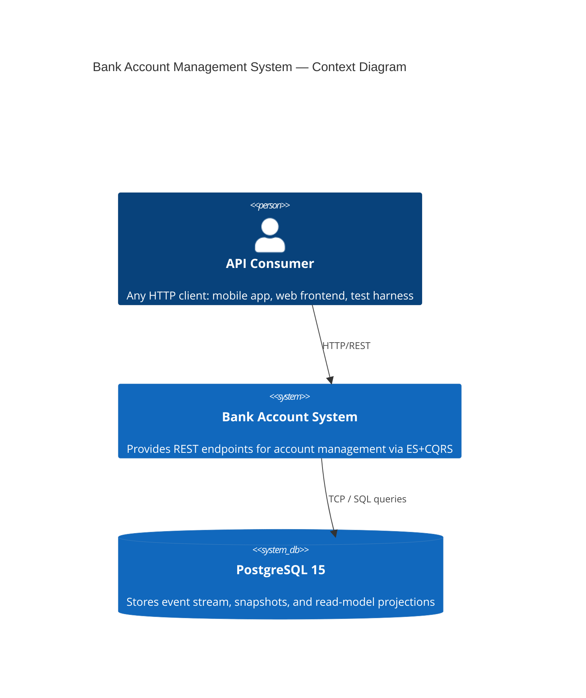

### Key Principles

| Principle | How It's Applied |
|---|---|
| **Single Source of Truth** | The `events` table is the authoritative state; projections are derived |
| **Immutability** | Events are never updated or deleted — append-only |
| **Separation of Concerns** | Commands (write) and Queries (read) are completely separate code paths |
| **Eventual Consistency** | Read models are updated synchronously post-commit (lag ≈ 0 ms) |
| **Resilience** | Projections can always be rebuilt from the event log |

---

## 2. Pattern: Event Sourcing

Instead of storing current state (`UPDATE accounts SET balance = 300`), every change is recorded as an immutable event:

```
AccountCreated   { accountId, ownerName, currency, initialBalance }
MoneyDeposited   { accountId, amount, transactionId, description }
MoneyWithdrawn   { accountId, amount, transactionId, description }
AccountClosed    { accountId, reason }
```

**State reconstruction** replays these events in order to derive current state:

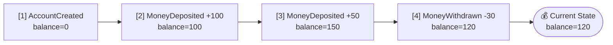

### Benefits of Event Sourcing

- ✅ **Complete Audit Trail** — every cent movement is permanently recorded
- ✅ **Time-Travel** — reconstruct any past state by replaying up to a timestamp
- ✅ **Debugging** — replay events in dev to reproduce exact production bugs
- ✅ **Multiple Projections** — same events feed different read models simultaneously
- ✅ **Event-Driven Extensions** — new consumers (email alerts, analytics) can read the same stream

---

## 3. Pattern: CQRS

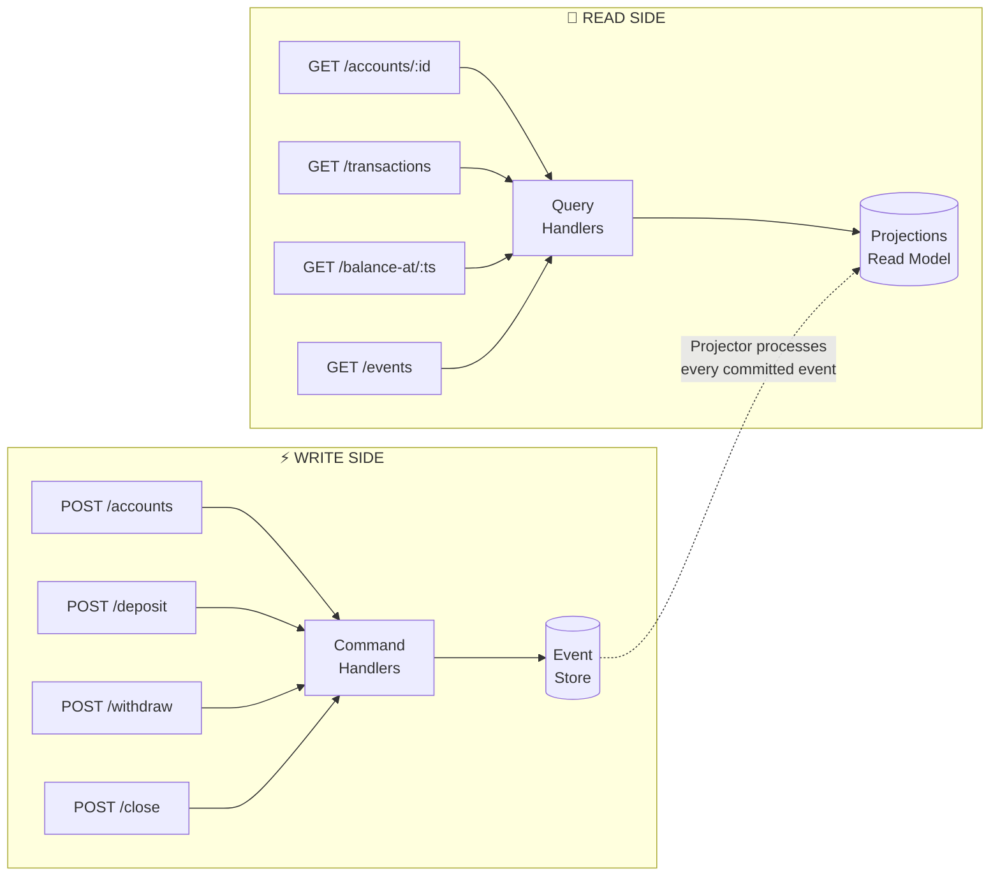

**Command handlers** never read from projections.  
**Query handlers** never write to the event store (exception: audit/time-travel reads raw events).

---

## 4. System Component Diagram

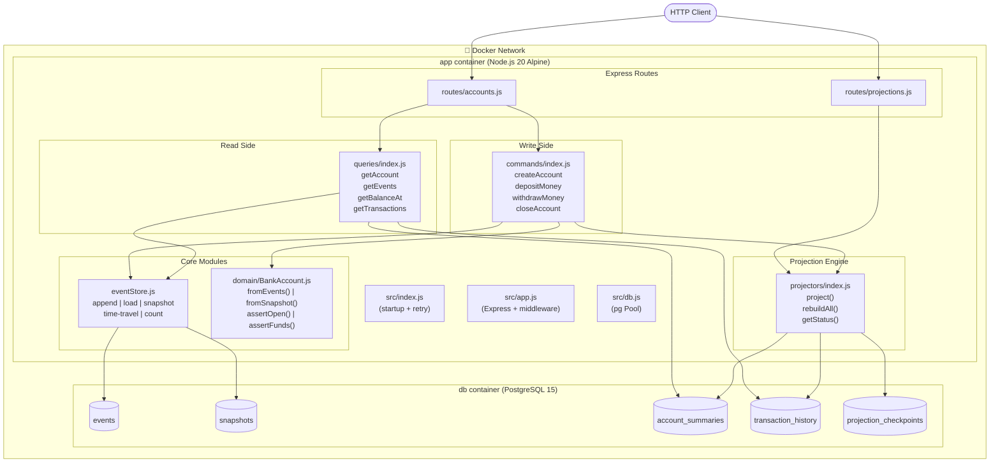

---

## 5. Database Architecture

### Events Table (Append-Only Write Model)

```sql
CREATE TABLE events (
    event_id        UUID                     PRIMARY KEY,
    aggregate_id    VARCHAR(255)             NOT NULL,  -- e.g., "acc-001"
    aggregate_type  VARCHAR(255)             NOT NULL,  -- "BankAccount"
    event_type      VARCHAR(255)             NOT NULL,  -- "MoneyDeposited"
    event_data      JSONB                    NOT NULL,  -- payload
    event_number    INTEGER                  NOT NULL,  -- per-aggregate sequence
    timestamp       TIMESTAMP WITH TIME ZONE NOT NULL DEFAULT NOW(),
    version         INTEGER                  NOT NULL DEFAULT 1,
    CONSTRAINT uq_events_aggregate_event UNIQUE (aggregate_id, event_number)
);
```

> `UNIQUE(aggregate_id, event_number)` is the **optimistic concurrency guard** — two concurrent writes for the same aggregate produce a `23505` violation, safely rejected as a 409.

### Snapshots Table

```sql
CREATE TABLE snapshots (
    snapshot_id       UUID         PRIMARY KEY,
    aggregate_id      VARCHAR(255) NOT NULL UNIQUE,  -- one per account
    snapshot_data     JSONB        NOT NULL,           -- full state
    last_event_number INTEGER      NOT NULL,           -- replay from here
    created_at        TIMESTAMP    NOT NULL DEFAULT NOW()
);
```

### Read Model Tables

```sql
-- Fast account state lookup
CREATE TABLE account_summaries (
    account_id VARCHAR(255)   PRIMARY KEY,
    owner_name VARCHAR(255)   NOT NULL,
    balance    DECIMAL(19,4)  NOT NULL,
    currency   VARCHAR(3)     NOT NULL,
    status     VARCHAR(50)    NOT NULL,   -- OPEN | CLOSED
    version    BIGINT         NOT NULL    -- optimistic version tracking
);

-- Paginated transaction feed
CREATE TABLE transaction_history (
    transaction_id VARCHAR(255)              PRIMARY KEY,
    account_id     VARCHAR(255)              NOT NULL,
    type           VARCHAR(50)               NOT NULL,   -- DEPOSIT | WITHDRAWAL
    amount         DECIMAL(19,4)             NOT NULL,
    description    TEXT,
    timestamp      TIMESTAMP WITH TIME ZONE  NOT NULL
);
```

### Entity Relationship Diagram

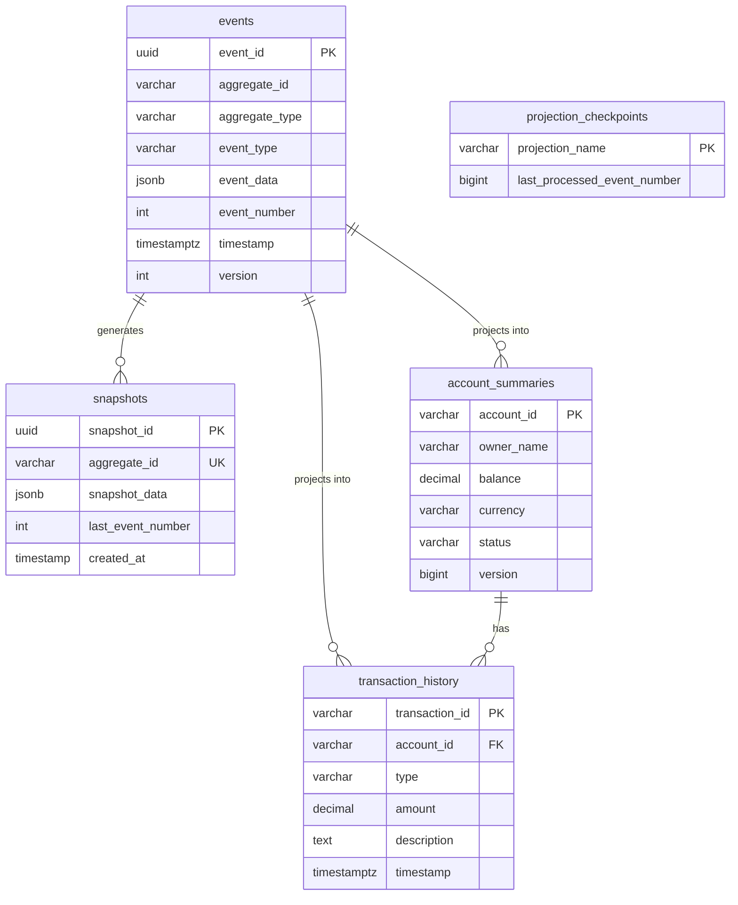

---

## 6. Write Model: Command Pipeline

Every command follows an identical pipeline:

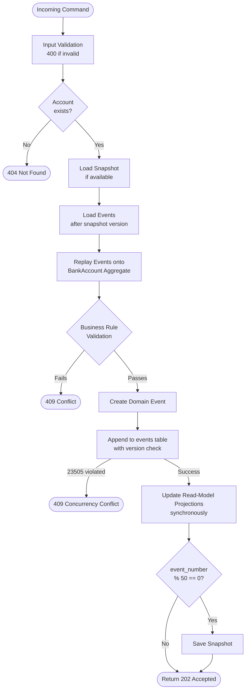

### Command Handlers

| Command | Preconditions | Event Emitted |
|---|---|---|
| `CreateAccount` | Account must NOT exist | `AccountCreated` |
| `DepositMoney` | Account OPEN; amount > 0; unique `transactionId` | `MoneyDeposited` |
| `WithdrawMoney` | Account OPEN; balance ≥ amount; unique `transactionId` | `MoneyWithdrawn` |
| `CloseAccount` | Account OPEN; balance = 0 | `AccountClosed` |

---

## 7. Read Model: Query Pipeline

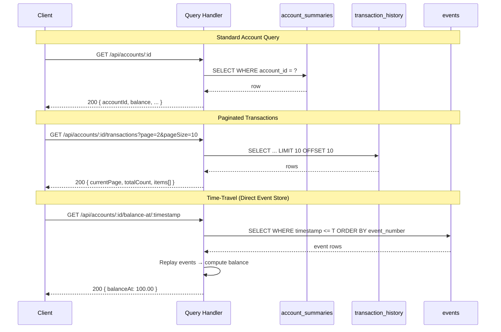

---

## 8. Projection Engine

The projector is the bridge between write and read models.

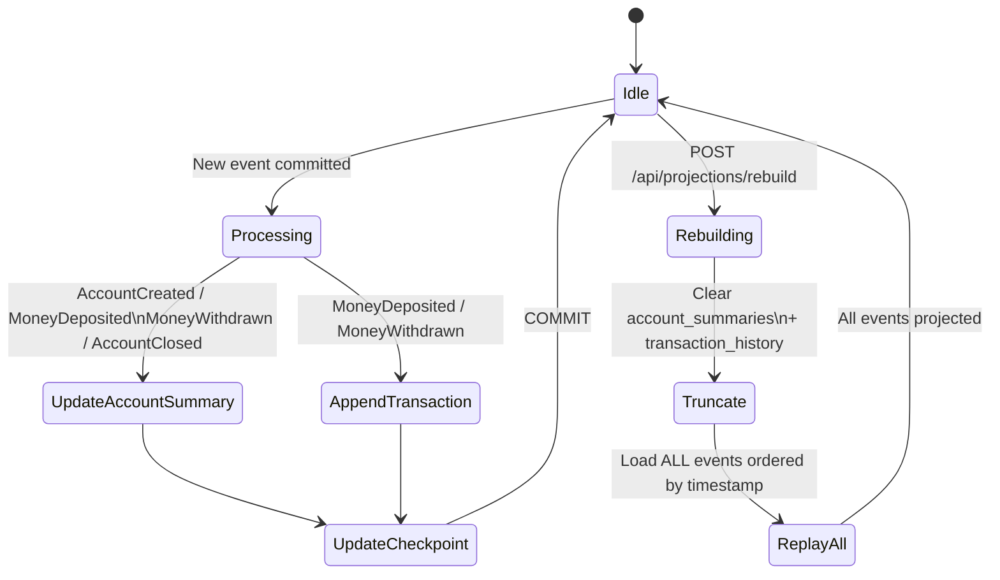

**Idempotency**: All projection INSERTs use `ON CONFLICT DO NOTHING`, making replays safe.

---

## 9. Snapshotting Strategy

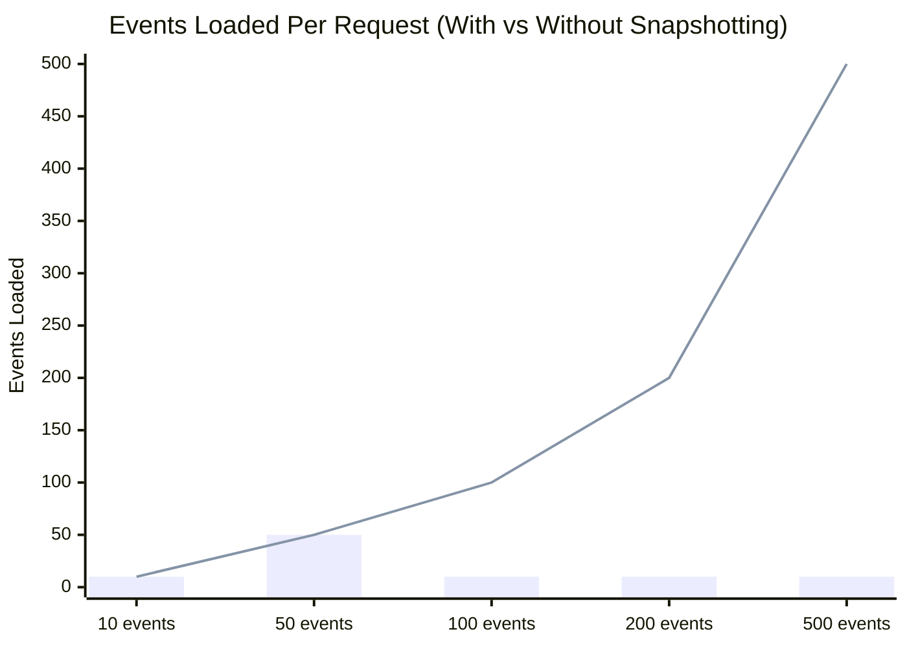

*Bar = with snapshotting (max 50 events loaded). Line = without snapshotting (all events).*

**Trigger**: After persisting an event where `event_number % 50 === 0`:

```js
// commands/index.js
const latestVersion = persistedEvents[persistedEvents.length - 1].event_number;
if (latestVersion % SNAPSHOT_THRESHOLD === 0) {
    const freshAccount = BankAccount.fromEvents(allEvents);
    await eventStore.saveSnapshot(aggregateId, freshAccount.toSnapshot(), latestVersion);
}
```

**Snapshot Data** (JSONB stored):
```json
{
  "accountId": "acc-001",
  "ownerName": "Alice",
  "balance": 1250.00,
  "currency": "USD",
  "status": "OPEN",
  "processedTransactionIds": ["txn-1", "txn-2", "..."]
}
```

---

## 10. Concurrency Model

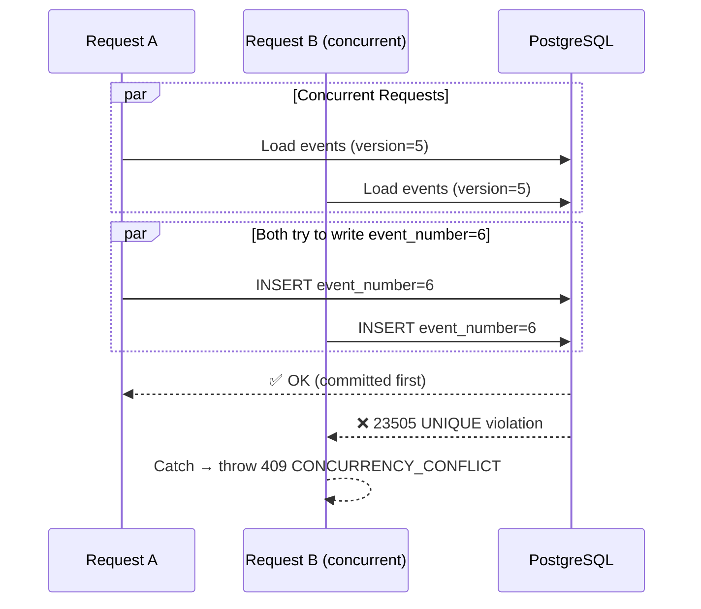

This is **Optimistic Concurrency Control** — no database-level locks are held, making the system highly concurrent while preventing data corruption.

---

## 11. Error Taxonomy

| HTTP Code | Error Code | Scenario |
|---|---|---|
| `400` | — | Missing/invalid fields; negative amounts |
| `404` | — | Account not found in event store or projection |
| `409` | `ACCOUNT_EXISTS` | Duplicate `accountId` on create |
| `409` | `INSUFFICIENT_FUNDS` | Withdrawal > balance |
| `409` | `ACCOUNT_CLOSED` | Operation on a closed account |
| `409` | `NON_ZERO_BALANCE` | Close attempted with non-zero balance |
| `409` | `CONCURRENCY_CONFLICT` | Concurrent write collision |
| `500` | — | Unhandled internal server error |

---

## 12. Docker / Infrastructure

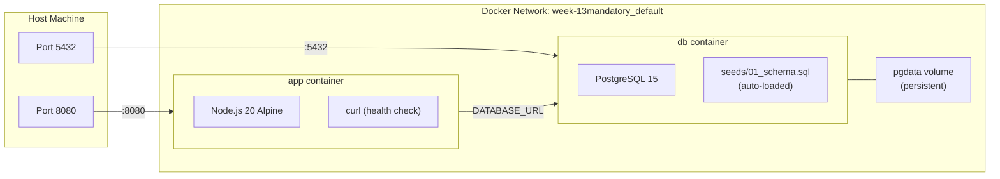

**Startup order**:
1. `db` starts → PostgreSQL loads → health check `pg_isready` passes
2. Seeds directory (`seeds/`) is automatically executed by the `postgres:15` image on first start
3. `app` starts (only after `db` is healthy) → Node.js retries DB connection → server binds to `API_PORT`

---

## 13. Design Trade-offs

| Decision | Chosen Approach | Alternative | Reason |
|---|---|---|---|
| Projection timing | **Synchronous** (in-request) | Async via message queue | Simplicity; near-zero lag without extra infra |
| Snapshot store | **UPSERT** (1 per aggregate) | Versioned snapshots | Simpler; storage-efficient for finance use case |
| Global event ordering | **timestamp + event_id** | Global sequence (serial) | Avoids global lock contention |
| Concurrency | **Optimistic** (DB constraint) | Pessimistic (SELECT FOR UPDATE) | Higher throughput; no deadlocks |
| Balance arithmetic | **Server-side float** | Database-side DECIMAL | Full precision maintained via DECIMAL(19,4) in DB |
| Idempotency scope | **transactionId in aggregate** | Dedupe table | Natural fit for ES; no extra table |
