# 📘 Project Documentation

> **Bank Account Management System**  
> Event Sourcing · CQRS · Node.js · PostgreSQL · Docker

---

## Table of Contents

1. [Project Overview](#1-project-overview)
2. [Problem Statement](#2-problem-statement)
3. [Solution Approach](#3-solution-approach)
4. [Key Concepts Explained](#4-key-concepts-explained)
5. [Tech Stack & Rationale](#5-tech-stack--rationale)
6. [Module Reference](#6-module-reference)
7. [Data Flow — End to End](#7-data-flow--end-to-end)
8. [Domain Events Reference](#8-domain-events-reference)
9. [API Endpoint Documentation](#9-api-endpoint-documentation)
10. [Business Rules & Validations](#10-business-rules--validations)
11. [Idempotency Design](#11-idempotency-design)
12. [Projection Rebuild Mechanism](#12-projection-rebuild-mechanism)
13. [Error Handling Strategy](#13-error-handling-strategy)
14. [Security Considerations](#14-security-considerations)
15. [Performance Characteristics](#15-performance-characteristics)
16. [Testing Strategy](#16-testing-strategy)
17. [Advantages & Disadvantages](#17-advantages--disadvantages)
18. [Real-World Applicability](#18-real-world-applicability)
19. [Setup & Installation Guide](#19-setup--installation-guide)
20. [Glossary](#20-glossary)

---

## 1. Project Overview

The **Bank Account Management System** is a production-grade REST API backend that demonstrates the practical implementation of two advanced distributed-systems patterns:

- **Event Sourcing** — storing all domain changes as an append-only log of immutable events
- **CQRS (Command Query Responsibility Segregation)** — using separate models for reading and writing data

### What It Does

| Capability | Description |
|---|---|
| Account Management | Create, close accounts with full lifecycle management |
| Transaction Processing | Deposits and withdrawals with business rule enforcement |
| Audit Log | Every transaction permanently recorded — irreversible |
| Time-Travel Queries | Reconstruct any past balance from history |
| Read Projections | Optimized read models for fast queries |
| Snapshot Optimization | Automatic state snapshots every 50 events |
| Projection Rebuilding | Full read-model recovery from event history |
| Projection Monitoring | Real-time lag tracking per projection |

---

## 2. Problem Statement

Traditional CRUD-based banking systems face critical limitations:

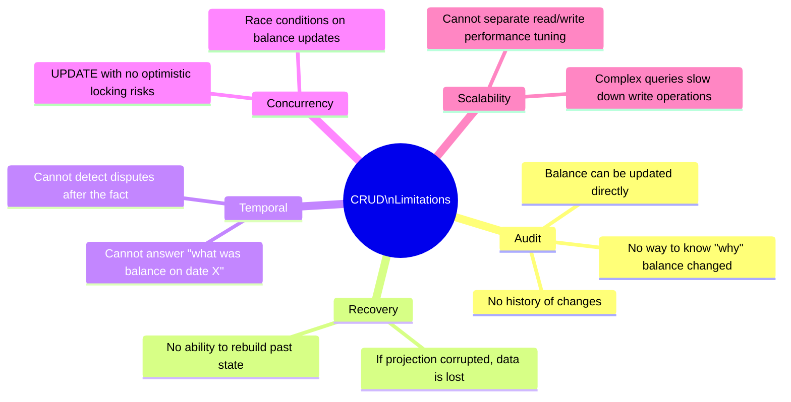

### The ES/CQRS Solution

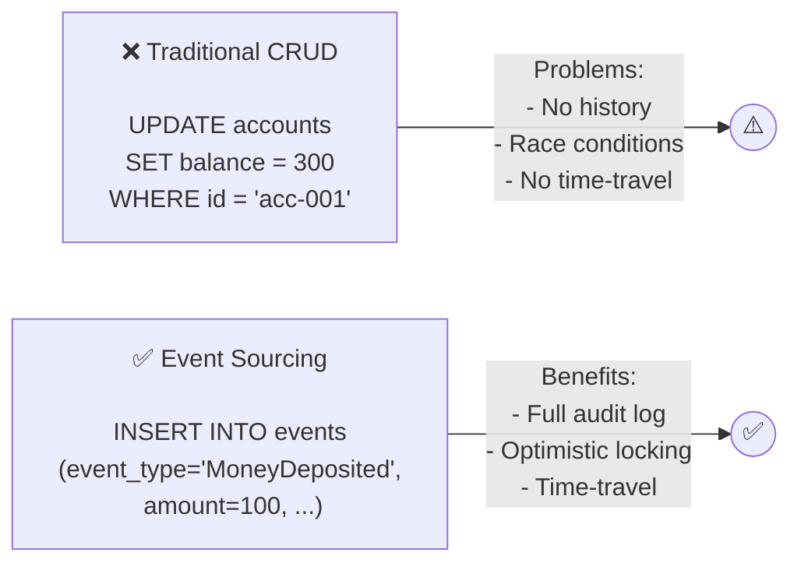

---

## 3. Solution Approach

The system is designed around the following architectural decisions:

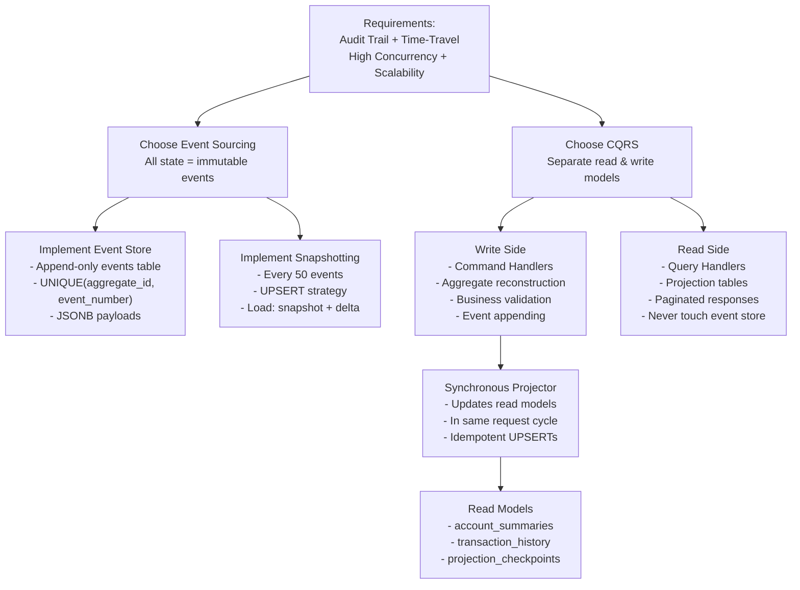

---

## 4. Key Concepts Explained

### 4.1 Aggregate

The **BankAccount** is an *aggregate* — a cluster of domain objects treated as a single unit. Its state is reconstituted entirely from its event history.

```
class BankAccount {
    accountId, ownerName, balance, currency, status, version
    processedTransactionIds  ← for idempotency

    static fromEvents(eventRows)          ← full replay
    static fromSnapshot(snapshot, events) ← snapshot + delta
    _apply(eventType, eventData)          ← mutates state
    assertOpen()                          ← throws if closed
    assertSufficientFunds(amount)         ← throws if insufficient
    hasProcessedTransaction(txnId)        ← idempotency check
    toSnapshot()                          ← serializable state
}
```

### 4.2 Event Store

The immutable log of all domain events. Acts as the **single source of truth**.

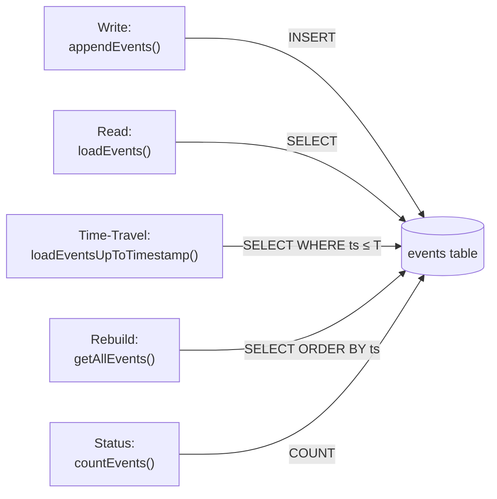

### 4.3 Projector

The projector reads committed events and updates the read-model tables. It runs **synchronously** after every `appendEvents()` call.

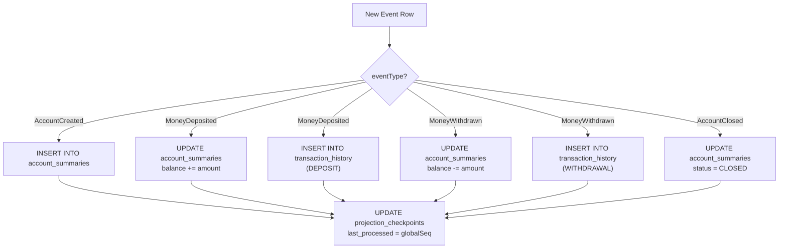

---

## 5. Tech Stack & Rationale

### Technology Choices

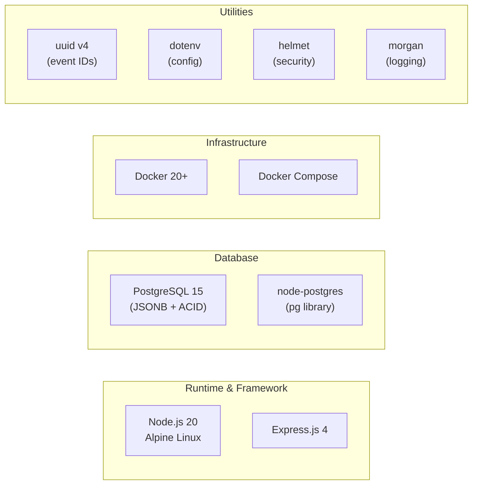

| Technology | Version | Why Chosen |
|---|---|---|
| **Node.js** | 20 Alpine | Async I/O ideal for event-driven workloads; small Docker footprint |
| **Express.js** | 4.18 | Minimal, battle-tested; no magic, full control |
| **PostgreSQL** | 15 | JSONB for flexible event payloads; ACID for durability; UNIQUE constraints for concurrency |
| **node-postgres** | 8.11 | Raw SQL control for complex event store queries; avoids ORM overhead |
| **Docker** | 20+ | Reproducible dev/prod environments; simplifies dependency management |
| **uuid** | 9.0 | RFC 4122 v4 UUIDs for globally unique event IDs |
| **helmet** | 7.1 | Sets secure HTTP headers automatically |

### Why NOT these alternatives?

| Alternative | Reason Not Chosen |
|---|---|
| MongoDB | Lacks proper ACID transactions across multiple documents |
| MySQL | No native JSONB; JSON support less mature |
| TypeScript | Adds build step; vanilla JS sufficient for this scope |
| Sequelize/TypeORM | ORMs abstract away the raw SQL control needed for event stores |
| Redis | No persistent append-only log; not suitable as primary event store |

---

## 6. Module Reference

### `src/eventStore.js` — Core Event Infrastructure

| Method | Signature | Description |
|---|---|---|
| `appendEvents` | `(aggregateId, aggregateType, expectedVersion, newEvents[])` | Appends events, throws 409 on version conflict |
| `loadEvents` | `(aggregateId, fromEventNumber?)` | Loads events after given version (for replay) |
| `aggregateExists` | `(aggregateId)` | Checks if any events exist for aggregate |
| `getLatestEventNumber` | `(aggregateId)` | Returns max `event_number` for aggregate |
| `loadSnapshot` | `(aggregateId)` | Returns latest snapshot or `null` |
| `saveSnapshot` | `(aggregateId, data, lastEventNumber)` | UPSERT snapshot |
| `getAllEvents` | `(afterTimestamp?)` | Returns all events (for rebuild) |
| `countEvents` | `()` | Returns total event count for lag tracking |
| `loadEventsUpToTimestamp` | `(aggregateId, timestamp)` | Returns events ≤ timestamp (time-travel) |

### `src/domain/BankAccount.js` — Aggregate Root

| Method | Type | Description |
|---|---|---|
| `fromEvents(rows)` | `static` | Reconstructs state from full event history |
| `fromSnapshot(snap, rows)` | `static` | Reconstructs from snapshot + subsequent events |
| `_apply(type, data, num)` | `private` | Applies a single event to in-memory state |
| `toSnapshot()` | `instance` | Serializes state for snapshot storage |
| `assertExists()` | `instance` | Throws 404 if account not created |
| `assertOpen()` | `instance` | Throws 409 if account is closed |
| `assertSufficientFunds(amount)` | `instance` | Throws 409 if balance < amount |
| `hasProcessedTransaction(id)` | `instance` | Returns true if `transactionId` already seen |

### `src/commands/index.js` — Write Side

| Function | Preconditions | Event |
|---|---|---|
| `createAccount(data)` | Account must NOT exist; `initialBalance` ≥ 0 | `AccountCreated` |
| `depositMoney(id, data)` | Account OPEN; amount > 0; novel transactionId | `MoneyDeposited` |
| `withdrawMoney(id, data)` | Account OPEN; balance ≥ amount; novel transactionId | `MoneyWithdrawn` |
| `closeAccount(id, data)` | Account OPEN; balance = 0 | `AccountClosed` |

### `src/queries/index.js` — Read Side

| Function | Data Source | Notes |
|---|---|---|
| `getAccount(id)` | `account_summaries` | 404 if not in projection |
| `getEvents(id)` | `events` table | Sorted by `event_number ASC` |
| `getBalanceAt(id, ts)` | `events` table | Replays up to timestamp |
| `getTransactions(id, page, size)` | `transaction_history` | `LIMIT/OFFSET` pagination |

### `src/projectors/index.js` — Projection Engine

| Function | Description |
|---|---|
| `project(eventRow, globalSeq)` | Updates read models for a single event; wrapped in DB transaction |
| `rebuildAll()` | TRUNCATE projections, reset checkpoints, replay all events |
| `getStatus()` | Returns `{ totalEventsInStore, projections[{ name, lastProcessedEventNumberGlobal, lag }] }` |

---

## 7. Data Flow — End to End

### Complete Deposit Flow

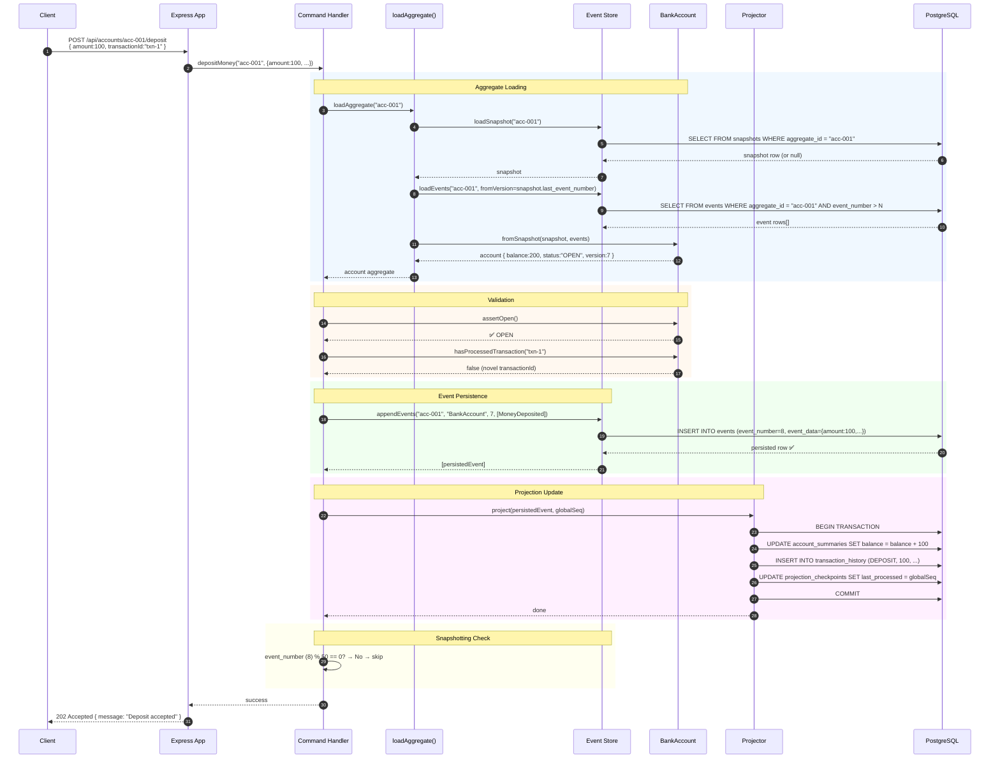

---

## 8. Domain Events Reference

### AccountCreated

```json
{
  "event_type": "AccountCreated",
  "event_data": {
    "accountId": "acc-001",
    "ownerName": "Alice Smith",
    "initialBalance": 0.0000,
    "currency": "USD"
  }
}
```

**Effect**: Creates `account_summaries` row with `balance=0`, `status=OPEN`.

---

### MoneyDeposited

```json
{
  "event_type": "MoneyDeposited",
  "event_data": {
    "accountId": "acc-001",
    "amount": 100.5000,
    "description": "Salary payment",
    "transactionId": "txn-abc-001"
  }
}
```

**Effect**: `account_summaries.balance += amount`; inserts `DEPOSIT` in `transaction_history`.

---

### MoneyWithdrawn

```json
{
  "event_type": "MoneyWithdrawn",
  "event_data": {
    "accountId": "acc-001",
    "amount": 50.0000,
    "description": "Rent",
    "transactionId": "txn-abc-002"
  }
}
```

**Effect**: `account_summaries.balance -= amount`; inserts `WITHDRAWAL` in `transaction_history`.

---

### AccountClosed

```json
{
  "event_type": "AccountClosed",
  "event_data": {
    "accountId": "acc-001",
    "reason": "Customer request"
  }
}
```

**Effect**: `account_summaries.status = 'CLOSED'`.

---

## 9. API Endpoint Documentation

### POST /api/accounts

```
Creates a new bank account. Generates an AccountCreated event.

Request:
  Content-Type: application/json
  {
    "accountId": "string"      ← required, must be globally unique
    "ownerName": "string"      ← required
    "initialBalance": number   ← optional, default 0, must be ≥ 0
    "currency": "string"       ← optional, default "USD", 3 chars
  }

Responses:
  202 → {"message": "Account creation accepted", "accountId": "..."}
  400 → {"error": "accountId and ownerName are required"}
  409 → {"error": "Account acc-001 already exists", "code": "ACCOUNT_EXISTS"}
```

---

### POST /api/accounts/:accountId/deposit

```
Deposits money into an account. Generates a MoneyDeposited event.

Params:
  accountId: path parameter

Request:
  {
    "amount": number          ← required, must be > 0
    "description": "string"  ← optional
    "transactionId": "string" ← required, for idempotency
  }

Responses:
  202 → {"message": "Deposit accepted", "accountId": "..."}
  400 → {"error": "amount must be a positive number"}
  400 → {"error": "transactionId is required"}
  404 → {"error": "Account not found"}
  409 → {"error": "Account is closed", "code": "ACCOUNT_CLOSED"}

Note: If transactionId was already processed, returns 202 with no new event (idempotent).
```

---

### POST /api/accounts/:accountId/withdraw

```
Withdraws money from an account. Generates a MoneyWithdrawn event.

Responses:
  202 → success
  400 → invalid amount or missing transactionId
  404 → account not found
  409 → INSUFFICIENT_FUNDS or ACCOUNT_CLOSED

Note: Withdrawal that would make balance negative is rejected with 409.
```

---

### POST /api/accounts/:accountId/close

```
Closes a bank account. Generates an AccountClosed event.
Account MUST have a zero balance.

Request:
  { "reason": "string" }  ← optional

Responses:
  202 → success
  404 → account not found
  409 → NON_ZERO_BALANCE (if balance > ~0.0001)
```

---

### GET /api/accounts/:accountId

```
Returns current account state from the read-model projection.
Never touches the event store.

Response 200:
  {
    "accountId": "acc-001",
    "ownerName": "Alice Smith",
    "balance": 300.0000,
    "currency": "USD",
    "status": "OPEN"
  }

Response 404: Account not found in projection (may not exist, or projection pending rebuild)
```

---

### GET /api/accounts/:accountId/events

```
Returns the complete event stream for an account (audit log).
Reads directly from the event store.

Response 200:
  [
    {
      "eventId": "uuid",
      "eventType": "AccountCreated",
      "eventNumber": 1,
      "data": { ... },
      "timestamp": "2026-02-25T05:17:29.923Z"
    },
    ...
  ]
```

---

### GET /api/accounts/:accountId/balance-at/:timestamp

```
Time-travel query: reconstructs balance at a specific historical moment.
Replays all events up to (and including) the given timestamp.

Path param: timestamp (ISO 8601, URL-encoded)

Response 200:
  {
    "accountId": "acc-001",
    "balanceAt": 100.00,
    "timestamp": "2026-01-15T12:00:00.000Z"
  }

Example:
  GET /api/accounts/acc-001/balance-at/2026-01-15T12%3A00%3A00.000Z
```

---

### GET /api/accounts/:accountId/transactions

```
Paginated transaction history from the read-model projection.

Query params:
  page     (default: 1)
  pageSize (default: 10, max: 100)

Response 200:
  {
    "currentPage": 2,
    "pageSize": 10,
    "totalPages": 3,
    "totalCount": 25,
    "items": [
      {
        "transactionId": "txn-001",
        "type": "DEPOSIT",
        "amount": 100.00,
        "description": "Salary",
        "timestamp": "..."
      }
    ]
  }
```

---

### POST /api/projections/rebuild

```
Administrative endpoint: truncates all read-model tables and replays 
the complete event history to rebuild projections from scratch.

Fire-and-forget: returns 202 immediately. Processing happens asynchronously.

Response 202:
  { "message": "Projection rebuild initiated." }

Use case: After discovering a bug in projection logic, or after adding a new
read model field, rebuild to ensure all data is consistent.
```

---

### GET /api/projections/status

```
Returns real-time projection health metrics.

Response 200:
  {
    "totalEventsInStore": 150,
    "projections": [
      {
        "name": "AccountSummaries",
        "lastProcessedEventNumberGlobal": 150,
        "lag": 0
      },
      {
        "name": "TransactionHistory",
        "lastProcessedEventNumberGlobal": 150,
        "lag": 0
      }
    ]
  }

lag = totalEventsInStore - lastProcessedEventNumberGlobal
A lag > 0 indicates projections are behind (temporary during rebuild).
```

---

## 10. Business Rules & Validations

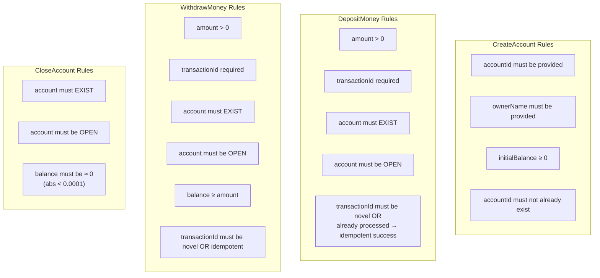

---

## 11. Idempotency Design

Idempotency prevents double-processing of the same command (e.g., network retries).

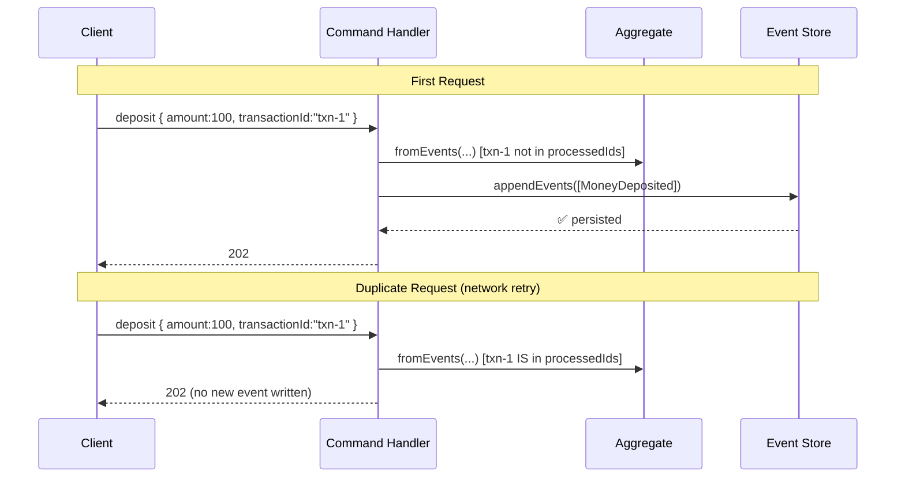

The `processedTransactionIds` set is part of the snapshot data, so it survives across server restarts.

---

## 12. Projection Rebuild Mechanism

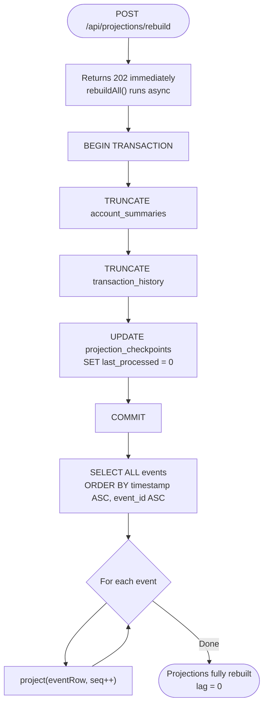

**Why this matters**: If a bug is found in the projection logic, simply fix the code and call `/api/projections/rebuild`. The system derives everything from the immutable event log — no data is ever truly lost.

---

## 13. Error Handling Strategy

All errors flow through a single Express error middleware in `src/app.js`:

```js
app.use((err, req, res, next) => {
    const status = err.status || 500;
    const body = { error: err.message };
    if (err.code) body.code = err.code;
    res.status(status).json(body);
});
```

| Validation Layer | Handles |
|---|---|
| Route handler | Missing path params, obviously invalid types |
| Command handler | Business rule violations (balance, status, uniqueness) |
| EventStore | Concurrency conflicts (DB unique violation → 409) |
| Express error middleware | Catches all unhandled errors, logs 500s, formats response |

---

## 14. Security Considerations

| Concern | Mitigation |
|---|---|
| HTTP header leakage | `helmet` middleware sets secure headers (X-Frame-Options, CSP, etc.) |
| SQL injection | `node-postgres` parameterized queries (`$1, $2, ...`) — never string interpolation |
| CORS | `cors` middleware; configure allowed origins for production |
| Sensitive data in logs | `morgan` logs only URL + method, not request bodies |
| Environment secrets | Loaded from `.env` via `dotenv`; `.env` is not committed to git |
| Input validation | All command inputs validated before aggregate load |

> **Production Note**: Add rate limiting (e.g., `express-rate-limit`), authentication (e.g., JWT), and TLS termination before deploying publicly.

---

## 15. Performance Characteristics

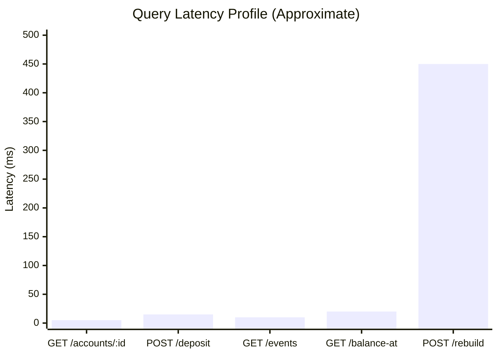

| Operation | Complexity | Notes |
|---|---|---|
| `GET /accounts/:id` | O(1) | Single indexed lookup on `account_id` |
| `POST /deposit` | O(E/50) | E = events since last snapshot; bounded at 50 |
| `GET /transactions` | O(pageSize) | Indexed + paginated scan |
| `GET /balance-at` | O(E) | Full replay up to timestamp; no snapshot optimization |
| `POST /projections/rebuild` | O(N) | N = total events; rare maintenance operation |

### Optimizations In Place

- **Snapshot every 50 events** — O(E) replay bounded to O(50) after first snapshot
- **Indexes on `aggregate_id`** — O(log N) event retrieval
- **PostgreSQL connection pool** — avoids per-request connection overhead
- **Parameterized queries** — PostgreSQL query plan caching

---

## 16. Testing Strategy

### Test Coverage Matrix

| Layer | Test Type | Tool | Status |
|---|---|---|---|
| API Endpoints | End-to-End | PowerShell/curl | ✅ 25/25 pass |
| Business Rules | Integration | E2E via HTTP | ✅ covered |
| Event Ordering | Integration | Response validation | ✅ covered |
| Time-Travel Accuracy | Integration | Timestamp-based | ✅ covered |
| Pagination | Integration | page/pageSize params | ✅ covered |
| Projection Rebuild | Integration | Truncate + verify | ✅ covered |
| Snapshotting | Integration | 51+ events + check | ✅ covered |
| Idempotency | Integration | Same transactionId twice | ✅ covered |

### Running Tests

```bash
# Start containers
docker-compose up -d

# Run full test suite
powershell -ExecutionPolicy Bypass -File test_all.ps1
```

### Test Scenarios

```
Scenario 1: Account Lifecycle
  1. Create account (202)
  2. Deposit $100 (202)
  3. Withdraw $40 (202)
  4. GET account → balance=60, status=OPEN (200)
  5. Close with balance → 409
  6. Withdraw $60 (202)
  7. Close → 202
  8. Deposit to closed → 409

Scenario 2: Idempotency
  1. Deposit with transactionId="txn-1" → 202, event written
  2. Deposit with transactionId="txn-1" → 202, NO new event

Scenario 3: Time-Travel
  1. Create account
  2. Deposit $100
  3. Record timestamp T1
  4. Deposit $50
  5. GET /balance-at/T1 → balanceAt=100 ✅

Scenario 4: Pagination
  1. Create account
  2. Make 12 deposits
  3. GET /transactions?page=2&pageSize=10
  4. Verify: items.length=2, currentPage=2, totalCount=12

Scenario 5: Projection Rebuild
  1. Make transactions
  2. POST /projections/rebuild → 202
  3. Wait 5s
  4. GET /accounts/:id → data restored correctly

Scenario 6: Snapshotting
  1. Create account
  2. Make 50 deposits (events 1-51 total)
  3. Verify balance=50
  4. Internally: snapshot created at event_number=50
```

---

## 17. Advantages & Disadvantages

### ✅ Advantages

| Advantage | Detail |
|---|---|
| **Complete Audit Trail** | Every cent movement permanently recorded |
| **Time-Travel** | Reconstruct any past state — invaluable for disputes |
| **Resilience** | Projections always rebuildable from event log |
| **Scalability** | Read side independently scalable; add more projectors or replicas |
| **Flexibility** | New read models created without changing write side |
| **Debuggability** | Replay production events locally to reproduce bugs exactly |
| **Concurrency Safety** | Optimistic locking prevents data corruption without DB locks |
| **Idempotency** | Network retries are safe by design |

### ⚠️ Disadvantages / Considerations

| Disadvantage | Detail | Mitigation |
|---|---|---|
| **Complexity** | More moving parts than CRUD | Good documentation; clear separation of concerns |
| **Eventual Consistency** | Read models may lag (here: near-zero lag) | Synchronous projections for this impl |
| **Large Event Stores** | Millions of events → slow full replays | Snapshotting (implemented) |
| **Schema Evolution** | Event format changes break old replays | Version field + upcasters (design guideline) |
| **Learning Curve** | ES/CQRS are non-trivial patterns | Comprehensive documentation (this file) |
| **No direct balance edit** | Correcting errors requires compensating events | Correct behavior in finance |

---

## 18. Real-World Applicability

This architecture pattern is used in production by major financial and tech companies:

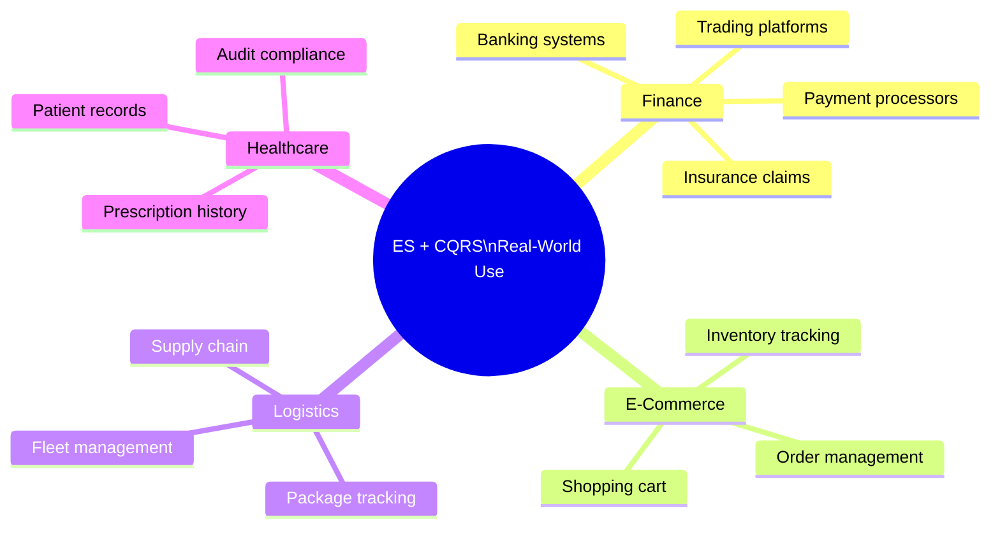

---

## 19. Setup & Installation Guide

### Prerequisites

| Requirement | Version | Check |
|---|---|---|
| Docker | 20.x+ | `docker --version` |
| Docker Compose | 2.x+ | `docker compose version` |

### Step-by-Step

```bash
# Step 1: Enter project directory
cd "week-13 mandatory"

# Step 2: Configure environment
cp .env.example .env
# Edit .env if needed (defaults work out-of-the-box)

# Step 3: Build and start all services
docker-compose up --build

# Step 4: Wait for health checks (~30-60 seconds)
# You will see:
#   Container week-13mandatory-db-1   Healthy
#   Container week-13mandatory-app-1  Started

# Step 5: Verify
curl http://localhost:8080/health
# Expected: {"status":"ok","timestamp":"..."}

# Step 6: Create your first account
curl -X POST http://localhost:8080/api/accounts \
  -H "Content-Type: application/json" \
  -d '{
    "accountId": "my-first-account",
    "ownerName": "John Doe",
    "initialBalance": 0,
    "currency": "USD"
  }'
# Expected: 202 {"message":"Account creation accepted"}
```

### Stop Services

```bash
# Stop (preserves data in pgdata volume)
docker-compose down

# Stop and remove all data (clean slate)
docker-compose down -v
```

### Rebuild Containers (after code changes)

```bash
docker-compose up --build -d
```

---

## 20. Glossary

| Term | Definition |
|---|---|
| **Aggregate** | A cluster of domain objects treated as a single consistency boundary; loads and saves as a unit |
| **Command** | An intent to change state (e.g., `DepositMoney`); may be rejected if invalid |
| **CQRS** | Command Query Responsibility Segregation — separate read/write models |
| **Event** | An immutable record of something that happened (past tense: `MoneyDeposited`) |
| **Event Number** | Per-aggregate monotonically increasing sequence of events |
| **Event Store** | The append-only database of all domain events; the ultimate source of truth |
| **Event Sourcing** | Storing state as a sequence of events rather than current values |
| **Idempotency** | Property where running same operation multiple times produces same result |
| **Optimistic Concurrency** | Detecting conflicts at write time rather than locking at read time |
| **Projection** | A read-optimized view built by processing events |
| **Projector** | The component that processes events and updates projections |
| **Query** | A read-only request that never changes state |
| **Snapshot** | A serialized point-in-time state of an aggregate, used to skip event replay |
| **Time-Travel Query** | Reconstructing state at a historical point by replaying events up to that time |
| **Aggregate Version** | The `event_number` of the last applied event; used for optimistic concurrency |
| **Lag** | Difference between total events and events processed by a projection |
| **Upcaster** | A function that transforms old event schemas to current format during replay |
